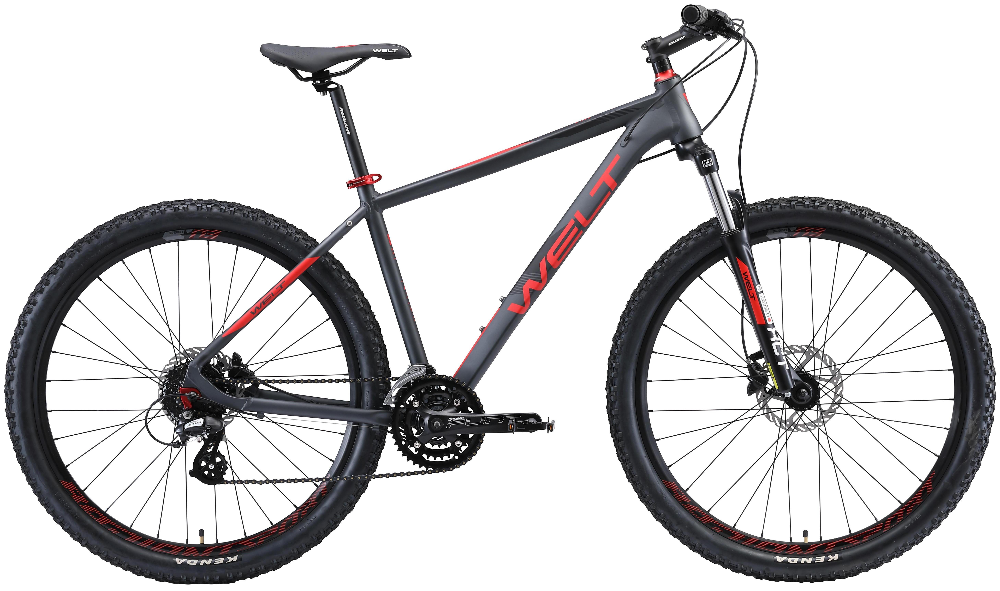

# Велосипед

## Что это такое?
Велосипед — это простое транспортное средство с двумя колёсами, которое приводится в движение мускульной силой человека через педали.
По сути, это машина для езды, которая помогает нам быстро передвигаться, не используя топливо.

## История в двух словах
Первый велосипед был изобретён в XIX веке. 
Он назывался «костотряс» и был без педалей — на нём нужно было отталкиваться ногами от земли. Позже появилась модель с огромным передним колесом — «пенни-фартинг». 
Цепная передача и надувные шины, которые сделали велосипед удобным и похожим на современный, появились в конце 19 века.

### Как он работает?
- Человек крутит педали
- Педали вращают цепь, которые передают усилие на заднее колесо.
- Руль помогает держать равновесие и менять направление.
- Тормоза позволяют снижать скорость и останавливаться.

###  Главные плюсы
- Польза для здоровья: Езда на велосипеде укрепляет сердце, лёгкие и мышцы ног.
- Экономия: Не нужно тратить деньги на бензин или общественный транспорт.
- Экология: Велосипед не производит вредных выхлопов и не вредит природе.

###  Какие бывают велосипеды?
- Городские: Удобные для ежедневных поездок по улицам.
- Горные: Прочные, с мощными колёсами для езды по бездорожью.
- Шоссейные: Лёгкие и быстрые, созданы для скорости на асфальте.
- Складные: Компактные, их легко взять с собой в общественный транспорт или хранить дома.

## Заключение
Велосипед — это гениальное изобретение, которое остаётся актуальным уже почти 200 лет. 
Он сочетает в себе простоту, пользу для человека и заботу об окружающей среде, являясь одним из самых удобных и доступных видов транспорта в мире.

